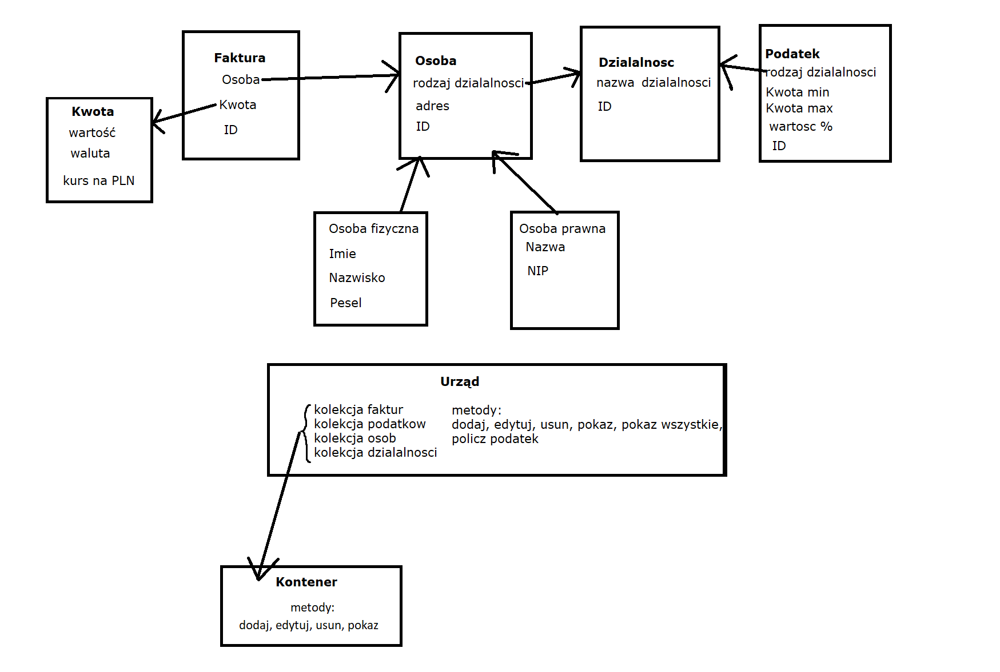

# 22L-PROI Projekt Podatki
 Autorzy: Wojciech Korniak i Grzegorz Siudak 
 ## Opis
Tematem projektu było stworzenie systemu dla urzędu skarbowego do rozliczania ludzi oraz przedsiębiorstw.
## Struktura

 - Klasa Urząd
 Główna klasa, posiadająca kolekcje faktur, podatków, osób i działalności. Obsługuje wybór operacji
 
 - Klasa Faktura
 Klasa reprezentująca fakturę przypisaną do konkretnej osoby, zawierająca kwotę. 
 
 - Klasa Kwota
 Reprezentacja kwoty z wartością, walutą i kursie na "PLN"
 
 - Klasa Podatek
Klasa reprezentująca podatek, przypisany do pewnego rodzaju działalności, z ustaloną kwotą maksymalną i minimalną.
 
 - Klasa Osoba
 Klasa bazowa klas OsobaFizyczna i OsobaPrawna, reprezentująca podatnika i zawierająca o nim informacje.
 
 - Klasa Działalność
 Klasa reprezentująca rodzaj działalności.
 
 - Klasa Kontener
 Kontener posiadający metody dodania, usunięcia, pokazania i edytowania elementu.
 

## Podział obowiązków
Wojciech Korniak - implementacja klasy Urząd, Faktura, Kwota i Kontener

Grzegorz Siudak - implementacja klasy Podatek, Osoba, Działalność oraz obsługi z konsoli
